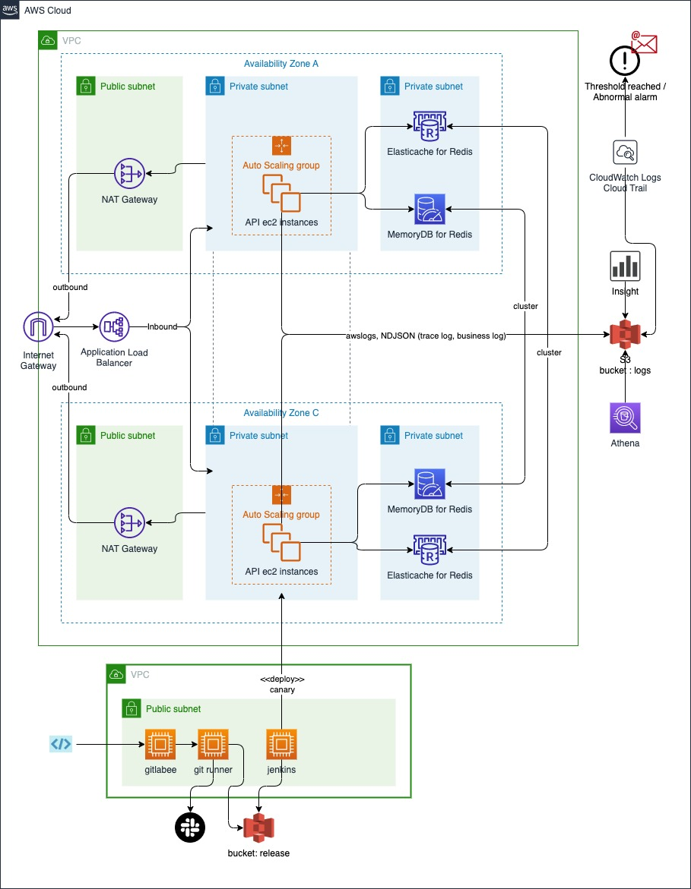

# place-search-service-api

`장소 검색 서비스`를 위한 서버 어플리케이션을 구현

* [Feature](#feature)
* [Getting started](#getting-started)
* [Run test](#run-test)
* [System architecture](#system-architecture)
* [List of open source libraries applied to the application and their purpose](#list-of-open-source-libraries-applied-to-the-application-and-their-purpose)
* [Implemented technical requirements](#implemented-technical-requirements)
* [Code format](*)

### Feature

[1] 장소 검색 API
* 장소명, 지번 주소, 문자열 유사도 비교 적용

[2] 검색 키워드 목록 조회 API
* redis 의 sorted set data type 을 이용하여, 검색 키워드와 score 를 저장 및 불러올 수 있도록 구성

### Getting started 

아래 두가지 항목에 대해 사전 설치가 되어 있어야 합니다 :

* amazon corretto jdk 11 (https://docs.aws.amazon.com/corretto/latest/corretto-11-ug/downloads-list.html)
* docker (https://www.docker.com/products/docker-desktop/)

검색 키워드를 저장하기 위해 redis in-memory db 준비 :
    
    $ docker pull redis 
    $ docker network create redis-net 
    $ docker run --name redis -p 6379:6379 --network redis-net -d redis redis-server --appendonly yes

어플리케이션 실행 :

	$ cd ~/{프로젝트 위치}
	$ ./gradlew bootRun -Dhealthcheck.filepath=alive.html -Dio.netty.leakDetection.level=advanced -Djava.net.preferIPv4Stack=true -Dreactor.netty.http.server.accessLogEnabled=false -Dexternal.api.dryRun=false

로그 위치 :

	$ cd ~/{프로젝트 위치}/logs/access.log - NDJSON 형식의 request/response 로그
	$ cd ~/{프로젝트 위치}/logs/business.log - NDJSON 형식의 application 로그, External API 관련 로그

어플리케이션 동작 여부 확인 :

    curl --location --request GET 'http://localhost:8080/health-check

### Run test
* 로직 테스트 (LogicTestCase) :

    $ ./gradlew test

* 장소 검색 API 테스트 :

    curl --location --request GET 'http://localhost:8080/v1/place?query=%EA%B3%B1%EC%B0%BD

* 검색 키워드 목록 조회 API 테스트 :
     
       
    curl --location --request GET 'http://localhost:8080/v1/place/search-keywords'

### How it works
* 어플리케이션은 Spring Boot(Webflux, Lettuce)를 사용합니다.
* Webflux 에서 지원하는 Functional routing and handling 모델 개념을 적용 하였습니다. 

그리고 주요 코드는 다음과 같이 구성됩니다.

1. `route`는 api endpoint 를 정의 합니다.
2. `handler`는 entity 와 서비스를 포함한 비즈니스 로직의 정의 합니다.
3. `dto`은 데이터 전송 개체를 쿼리하기 위한 객체들의 정의 합니다.
4. `repository`에는 database 의 실제 crud 정의 합니다.
5. `application.yml` 에는 각종 정적 설정 정보를 정의 합니다.

### System architecture

* AWS 기반에서 구성 되며, 실제 서비스를 구성 하게 된다는 가정하에 구상하였습니다.
* 고가용성 확보
  * MultiAZ 를 A Zone 과 C Zone 으로 각각 나누어,
    * 어플리케이션 서버 영역의 공격자나 외부 접근을 막기위해 private subnet 으로 구성하고
    * 마찬가지로 Database 도 공격자나 외부 접근을 막기위해 private subnet 을 구성 합니다.
    * inbound 의 경우 Application Load Balancer(이하 ALB) 를 통해 Target group(이하 TG) 로 구성된 어플리케이션 서버에 round robin 방식으로 부하를 분산 시킵니다.
    * outbound 의 경우 NAT Gateway 를 통해 양 Zone 간 하나씩 public ip로 배치 하여, 서버가 늘어나더라도 목적지에서 추가적인 방화벽 설정 작업을 줄 일 수 있도록 구성 하였습니다.
    * Auto Scaling(이하 AS) 의 경우 부하테스트와 실제 운영 지표를 cloud watch 를 통해 예상 요청 트래픽을 수용할 수 있는 적정 서버 수를 산정 하고, 수용 범위를 초과 하였을때는 양 Zone 에 n 개씩 늘리 수 있게 설정이 필요합니다.
  * 어플리케이션 내에 서버 캐싱을 적용 하여, write 보다 read 가 많은 요청의 경우나 데이터가 자주 바뀌지 않는 설정 정보의 경우 Database 에 요청 횟수를 줄일 수 있도록 설정 하였습니다.
  * latency 를 줄이기 위해 리전간 시스템 구성도 고려 하였지만, 해당 과제에서 요구하는 범위 밖인 것으로 판단 하여 고려 하지 않았습니다.
* 내결함성 확보
  * 어플케이션내에 Circuit Breaker 기능을 추가하여, 필요 구간에서 지연이나 바로 복구가 불가능 한 상황 발생시, 문제가 되는 요청은 거부하여 요청이 밀려 요청지와 목적지 전체 서비스 불능 상태를 방지 시키고,
  * 다른 요청에 대해서는 정상 서비스 될 수 있도록 설정하였습니다.
  * 어플리케이션 내에서 Database 및 외부 시스템에 API 요청시 backoff 와 jitter 를 기본 적용 하여, failover 나 네트워크 순단 같은 상황시를 대비 할 수 있도록 설정 하였습니다.
* Deploy
  * AWS code commit/artifact/build/deploy 사용 하거나, 
  * 사용이 불가능 하다면 VPC 에 배포 환경 구축 하는 것으로 구상 하였으며, 아래와 같은 순서로 배포 관리를 생각해 보았습니다. 
    1. 소스 코드를 git repository 에 커밋 및 푸시를 합니다.
    2. git runner 를 통해 jar 로 변환한 어플리케이션을 S3에 지속적으로 업로드 합니다.
    3. jenkins 를 통해 canary 배포를 진행 하고, 일정 시간 모니터링 후 전체를 배포 합니다.
    4. 각 서버는 요청을 처리 중 인 경우가 대부분 이므로, ALB 에서 배포 대상 서버를 out of service 로 전환 시키는 과정을 추가 하고 (alive.html),
    5. kill -15 요청을 보내 응답이 모두 처리 된 후에 graceful 하게 내려 갈 수 있도록 제어 합니다. (이때 정상적으로 내려 가지 않는지 지속적으로 체크하는 부분도 필요 합니다.)
    6. 이후 S3에서 새버전의 어플리케이션을 내려 받아 기동 시킨 후 ALB 투입 될 수 있도록 구성 합니다.
    7. 이때 slack 이나 조직의 메신저 Bot API 를 통해 진행 과정을 조직에 공유 될 수 있도록 합니다.
* Log & Monitoring
  * 로그는 `NDJSON` 방식으로 어플리케이션에서 남길 수 있도록 구성 하였습니다.
  * 각 서버에 agent 를 설정 하여, 실시간으로 S3 로 쌓일 수 있도록 합니다.
  * Cloudwatch
    * TG 별, AS 별 서버 리소스 지표를 대시 보드와 경고에 설정 하고 임계치를 초과 하는 경우 메일 알림을 받을 수 있도록 구성합니다.
  * Cloudwatch log
    * S3에 쌓인 어플리케이션 log를 기반으로, 에러 로그나 트래픽 급증/감 등을 커스텀 지표로 설정하고, 임계치를 초과 하는 경우 메일 알림을 받을 수 있도록 구성합니다.
  * Insight, Athena
    * S3에 쌓인 어플리케이션 log를 분석할 필요가 있을때, 선택적으로 사용 합니다.
* Database
  * Database는 낮은 지연율과 reactive programing 을 위해 
    * `Elasticache` (https://aws.amazon.com/ko/elasticache/) 
    * `Memory DB for Redis` (https://aws.amazon.com/ko/memorydb/) 또는 `Dynamo DB` (https://aws.amazon.com/ko/dynamodb/)
  * 를 선정 하였습니다.
  * 요구 사항에 좀 더 정교한 Transaction 이 필요하다면, 아래의 조합을 도입 할 수도 있을 것 같습니다.
    * `Aurora DB for mysql` (https://aws.amazon.com/ko/rds/aurora/)
    * `R2DBC` (https://r2dbc.io/)  

  
### List of open source libraries applied to the application and their purpose
* 오픈소스 라이브러리의 기본 선택 기준은, 최근까지 패치나 기능이 추가되고 유지 보수 되고 있는 점과 많은 컨트리뷰터의 기여도 등을 우선적으로 확인 합니다.
* 또한 이슈업에 얼마나 빠르게 응답 하는지도 판단 기준으로 보고 있습니다. 

| 라이브러리 | 용도                                                                                                             |
| -------- |----------------------------------------------------------------------------------------------------------------|
| org.springframework.boot:spring-boot-starter-webflux | 비차단 비동기 어플리케이션 및 이벤트 중심인 반응형 프로그래밍을 구현 하기위해 선택                                                                 |
| org.springframework.boot:spring-boot-starter-aop | 어플리케이션 내 서버 캐싱을 구현 적용 하기 위해 선택                                                                                 |
| org.springframework.boot:spring-boot-configuration-processor | application.yml 을 읽어 들여 커스텀 property를 구현 하기 위해 선택                                                              |
| org.springframework.boot:spring-boot-starter-data-redis-reactive | 비차단 비동기 redis 연결 구현을 위해 선택                                                                                     |
| io.projectreactor.addons:reactor-extra | webflux 는 기본적으로 project recator 를 기반으로 구현되어 있고, reactor-core의 확장된 기능을 제공 하는 라이브러리로서 선택                         |
| io.projectreactor:reactor-tools | webflux 는 기본적으로 project recator 를 기반으로 구현되어 있고, 디버깅과 개발을 용이하게 해주는 라이브러리로서 선택                                   |
| io.projectreactor:reactor-test | test case 작성시 검증에 필요한 기능을 제공 하는 라이브러리로서 선택                                                                     |
| io.github.resilience4j:resilience4j-spring-boot2 | Circuit Breaker 기능을 제공 하는 라이브러리로서 선택                                                                           |
| io.github.resilience4j:resilience4j-reactor | 반응형 Circuit Breaker 기능을 제공 하는 라이브러리로서 선택                                                                       |
| org.springframework.boot:spring-boot-starter-logging | 어플리케이션 로그를 설정하기 위한 기능을 제공하는 라이브러리로서 선택                                                                         |
| net.logstash.logback:logstash-logback-encoder | elasticsearch 나 다른 로그 분석 시스템에서 필요한 encode나 적재 기능을 제공 하는 라이브러리로서 선택                                             |
| org.springframework.boot:spring-boot-starter-cache | 서버 캐싱기능을 구현하기 위한 라이브러리로서 선택                                                                                    |
| com.github.ben-manes.caffeine:caffeine | 서버 캐싱을 구현하기 위한 라이브러리로서 선택                                                                                      |
| info.debatty:java-string-similarity | 문자열 유사도 비교를 위한 여러가지 알고리즘을 적용한 기능을 제공 하는 라이브러리로서 선택                                                             |
| org.modelmapper:modelmapper | DTO 간 또는 Entity 간 복잡한 코드 없이 전환 해주는 기능을 제공 하는 라이브러리로서 선택                                                        |
| org.projectlombok:lombok | Boilerplate code 를 annotation 으로 작성할 수 있는 기능을 제공 하는 라이브러리로서 선택                                                 |
| io.projectreactor.tools:blockhound | 잘못된 블럭킹 메소드 호출을 찾아주는 기능을 제공 하는 라이브러리로서 선택, 다만 프로덕션에서는 적용 불가, 성능 저하가 의심되는 직접 작성한 코드에 대해 서만 임시적으로 적용하여 디버깅 할 수 있다 |
| org.springframework.boot:spring-boot-starter-test | test case 를 구현하기 위한 기능을 제공 하는 라이브러리로서 선택                                                                       |
| org.junit.jupiter:junit-jupiter-api | test case 를 구현하기 위한 기능을 제공 하는 라이브러리로서 선택                                                                       |
| org.junit.jupiter:junit-jupiter-engine | test case 를 구현하기 위한 기능을 제공 하는 라이브러리로서 선택                                                                       |
| io.netty:netty-resolver-dns-native-macos:4.1.86.Final:osx-aarch_64 | 애플 실리콘 환경에서 개발 하기 위해 netty에서 제공하는 라이브러리로서 선택                                                                   |
| org.springframework.cloud:spring-cloud-dependencies:2021.0.2 | Circuit Breaker 기능을 제공 하는 라이브러리로서 선택                                                                                                                   |

### Implemented technical requirements
* 동시성 이슈가 발생할 수 있는 부분을 염두에 둔 설계 및 구현 (예시. 키워드 별로 검색된 횟수)
  * 키워드 별로 검색된 횟수를 일반 RDB 사용할 경우 increment 시에 DeadLock 이 발생 할 수 있어,
  * redis 의 Sorted set Data type 을 활용하여 increment 시에 자동으로 정렬 시킬 수 있도록 하고,
  * 필요한 노출 수 만큼 가져 올 수 있도록 구성 하였습니다.
  * redis 는 사실상 단일 스레드 이므로 두 개의 스레드가 동시에 redis 에 명령을 보내더라도 redis 는 명령을 직렬 순서로만 실행 하기 때문에 DeadLock 을 피할 수 있습니다.
* 카카오, 네이버 등 검색 API 제공자의 “다양한” 장애 발생 상황에 대한 고려
  * [System architecture](#system-architecture) - `내결함성` 부분 에서도 서술 하였듯이
  * 중요 연동 구간에는 Circuit Breaker, Backoff, Jitter 를 적용 하여, 어플리케이션이 완전히 멈추지 않도록 하고
  * 부하를 받는 연동 시스템에 부하를 줄여 줄 수 있도록 고려 하였습니다.
  * 또한 [System architecture](#system-architecture) - `Log & Monitoring` 부분에 서술 했듯이, 어플리케이션 로그를 활용하여 가급적 빨리 장애 상황을 인지 할 수 있도록 고려 하였습니다.
* 구글 장소 검색 등 새로운 검색 API 제공자의 추가 시 변경 영역 최소화에 대한 고려
  * 이 부분에서는 많은 고려를 하지 못했습니다.
  * 다만 요청한 검색 결과를 공통 DTO에 담을 수 있도록 설계 하였으며, 이를 기준으로 검색 결과를 처리 할 수 있도록 하였습니다. 
* 서비스 오류 및 장애 처리 방법에 대한 고려
  * 원인 불명의 오류나 장애는 언제든지 발생 할 수 있다고 생각합니다.
  * [System architecture](#system-architecture) - `Log & Monitoring` 부분에 서술 했듯이, 최대한 빠르게 문제 상황을 인지 할 수 있도록, 환경을 구성하는게 첫번째이고
  * 기본적으로 이중화가 되어 있으므로, 어플리케이션 수정에 의한 문제라면 롤백을 진행하고
  * 인프라 문제라면 스탠바이 되어 있는 인프라 쪽으로 ALB 설정이나 강제 failover 등을 시켜서 우회 또는 대체를 시킬 수 있도록 대비 해야 할 것 같습니다. 
* 대용량 트래픽 처리를 위한 반응성(Low Latency), 확장성(Scalability), 가용성(Availability)을 높이기 위한 고려
  * 또한 서비스가 오래 될 수록 기술 부채나 무거운 기능들이 추가 되고 이로 인해 리소스 비용이 가중 되면서, 대용량 트래픽 처리가 어려운 경우를 종종 경험 하였습니다.
  * 해서 부하테스트 환경을 상시 사용 할 수 있도록 구축 하고 정기적으로 부하테스트를 실시하고, 대용량 트래픽에 문제가 되는 부분을 점진적으로 개선하는 작업을 루틴화 하는 것이 좋을 것 같습니다.
* 지속적 유지 보수 및 확장에 용이한 아키텍처에 대한 설계
  * 설계시 소스 코드 뿐만 아니라 시스템 구성도 단순함을 가장 우선으로 고려 해야 한다고 생각 합니다.
  * 단순함을 유지 하기 위한 간단한 방법 중, 코드나 시스템 구성에 명확한 네이밍과 규칙등을 정하고 예외를 최소화 해야 한다고 생각 합니다.
  * 네트워킹 부분 역시 서브넷, 방화벽, IP 구성 규칙등을 정하여, 단순히 네이밍 만으로도 어플리케이션과 시스템의 규모 위치등을 파악할 수 있어야 한다고 생각 합니다.
* 이 외에도 본인의 기술 역량을 잘 드러낼 수 있는 부분을 과제 코드 내에서 강조
  * 아쉽게도, 기술 역량을 잘 드러낼 수 있을 만큼 설계나 코드를 잘 구현 하지 못한 것 같습니다.
  * 죄송합니다.

### Code format 
* 코드 형식에는 spotless를 사용하였습니다. 

    
    $ ./gradlew spotlessJavaApply

